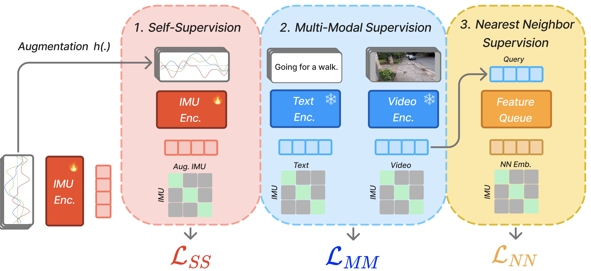

# PRIMUS 
This is the code repo for [PRIMUS](https://arxiv.org/abs/2411.15127), a novel pre-training approach to learn effective Inertial Measurement Unit (IMU) motion sensor representations with multimodal and self-supervised learning. This code is built off of the original repo developed
by [IMU2CLIP](https://arxiv.org/abs/2210.14395).

&nbsp;
<div align="center">
    
</div>

# Installation
```
conda create -n primus python=3.8
conda activate primus
pip install pytorch_lightning
pip install torchvision
pip install git+https://github.com/openai/CLIP.git # replace with clip4clip
pip install opencv-python
pip install matplotlib
pip install ffmpeg-python
pip install pandas
pip install transformers
```

## Setting up EgoExo4D
To obtain the EgoExo4D dataset for pretraining, please follow the [instructions given on the official EgoExo4D website](https://docs.ego-exo4d-data.org/getting-started/).

Here are the instructions for downloading the data partition that is relevant to this paper (correct as of June 2024, please refer to the official website for up-to-date instructions):
1. First review and sign the license agreement for getting access to EgoExo4D ([link](https://docs.ego-exo4d-data.org/getting-started/))
2. [Obtain the EgoExo4D Downloader CLI](https://github.com/facebookresearch/Ego4d?tab=readme-ov-file#setup)
3. Download the relevant parts (some of these commands could be redundant)
```
egoexo -o /path/to/egoexo/ --benchmarks egopose
egoexo -o /path/to/egoexo/ --benchmarks egopose --parts annotations
egoexo -o /path/to/egoexo/ --views ego
egoexo -o /path/to/egoexo/ --parts annotations metadata
```
The data should then be ready at the specified location (`/path/to/egoexo/`)

**Make sure** that this path matches the ones defined in [dataset/egoexo4d/dataloader.py](dataset/egoexo4d/dataloader.py) (`DATA_PATH` and `PATH_EGO_META`).

# Experiments

**To create a cache where the video frames are preprocessed run:**
```
python pretraining.py --path_configs ./configs/train_contrastive/ego4d_imu2text+video_mw2_sampling_rate=50.yaml --dataset "egoexo4d" --multihead 
```

**To run an example train loop with all three loss terms in the paper:**
```
python pretraining.py --path_configs ./configs/train_contrastive/ego4d_imu2text+video_mw2_sampling_rate=50.yaml --dataset "egoexo4d" --ssl_coeff 0.5 --transform_list 2 4 --multihead --nnclr
```

**To run a pretrained model in downstream task**
```
python downstream_evaluation/classification_downstream_egoexo4d.py --path_load_pretrained_imu_encoder $PATH_TO_CHECKPOINT  --num-shots $NUM_SHOTS --multihead 
```

# Citation
Please cite our work if you find our code repo useful:

```
@misc{das2024primuspretrainingimuencoders,
      title={PRIMUS: Pretraining IMU Encoders with Multimodal Self-Supervision}, 
      author={Arnav M. Das and Chi Ian Tang and Fahim Kawsar and Mohammad Malekzadeh},
      year={2024},
      eprint={2411.15127},
      archivePrefix={arXiv},
      primaryClass={cs.LG},
      url={https://arxiv.org/abs/2411.15127}, 
}
```
